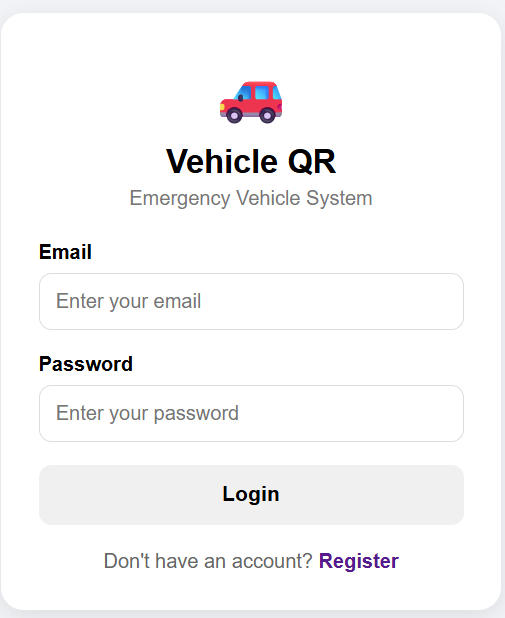
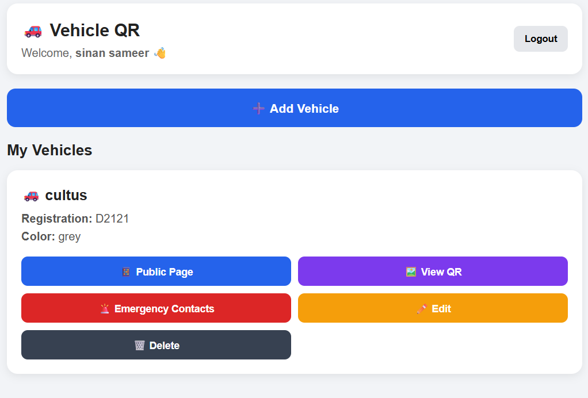
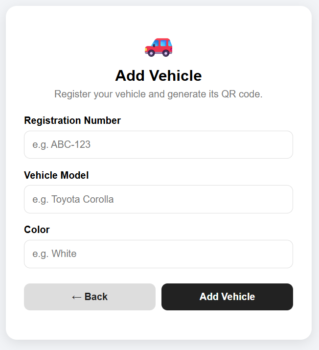
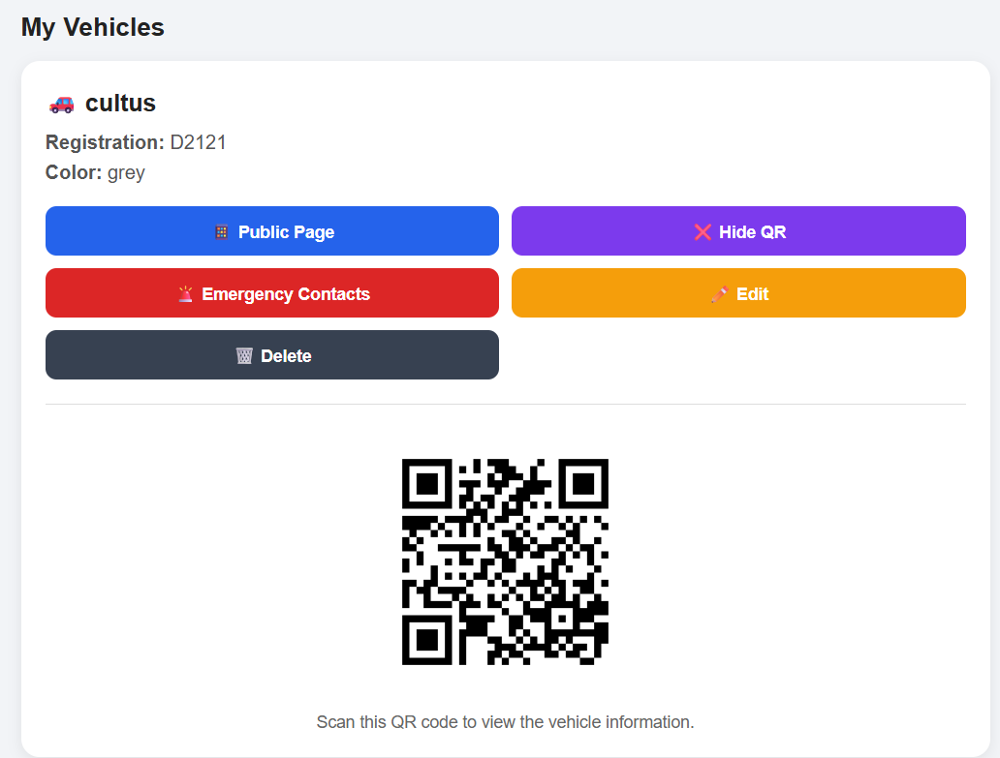
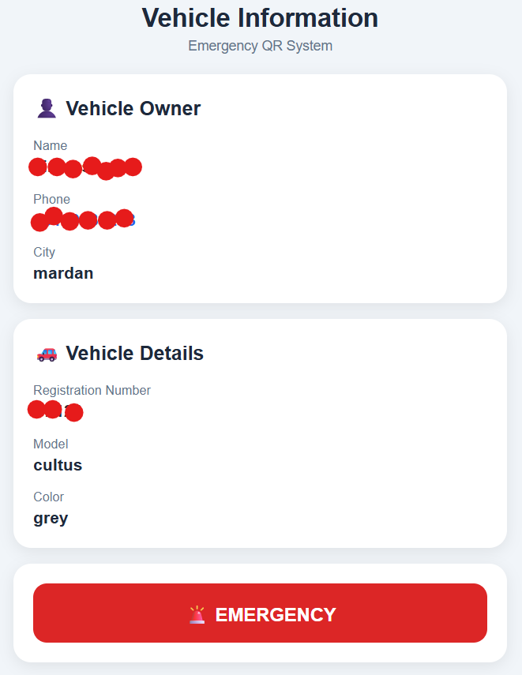
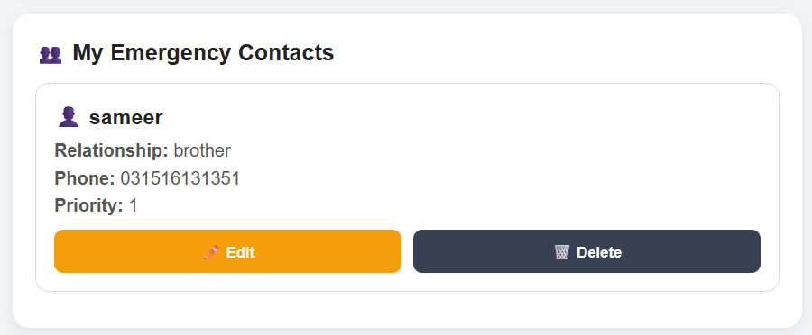

# Vehicle QR Emergency System

A web-based vehicle emergency management system built with Java, Spring Boot, MySQL, and QR codes.

## Overview

The Vehicle QR Emergency System allows vehicle owners to create an account, verify their email address, log in, manage vehicles, generate QR codes, and maintain emergency contact information.

The system is designed to provide useful vehicle information through a QR code during an emergency situation.

## Features

- User registration
- Email verification with OTP
- User login
- Vehicle management
- Add vehicles
- Edit vehicles
- Delete vehicles
- QR code generation
- Emergency contact management
- Public vehicle information
- MySQL database integration
- Email notifications

## Technologies Used

- Java 21
- Spring Boot
- Spring Data JPA
- Hibernate
- MySQL
- MySQL Connector/J
- Maven
- HTML
- CSS
- JavaScript
- Git
- GitHub

## Project Structure

```text
src/
├── main/
│   ├── java/
│   │   └── com/vehicle_qr_system/
│   │       ├── config/
│   │       ├── controller/
│   │       ├── model/
│   │       ├── repository/
│   │       └── service/
│   │
│   └── resources/
│       ├── static/
│       └── application.properties
│
└── test/

## Screenshots

### Login



### Dashboard



### Add Vehicle



### QR Code



### Public Vehicle Information



### Emergency Contacts



### Emergency Alert

